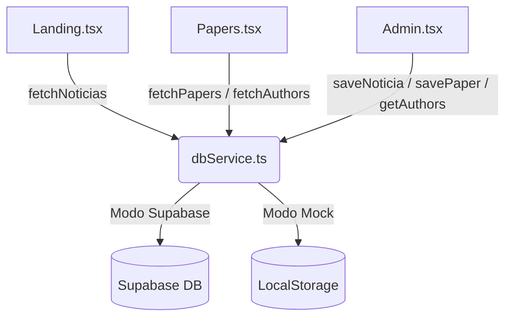

# Análisis de Fricción y Plan de Mitigación Técnica

Para garantizar un desarrollo sin fricciones entre el Desarrollador A y el Desarrollador B, es necesario identificar los archivos y recursos compartidos que podrían generar conflictos de fusión (merge conflicts) en Git o bloqueos durante la ejecución.

---

## 1. Puntos de Conflicto Potencial (Fricciones)

### A. El Archivo `Admin.tsx`
* **Problema:** Es un archivo de más de 1200 líneas que contiene la lógica CMS para ambos módulos. Si el Desarrollador A edita `handleSaveNoticia` y el Desarrollador B edita `handleSavePaper` y `fetchAuthors` directamente dentro del mismo archivo al mismo tiempo en ramas distintas de Git, se generarán conflictos complejos al integrar la rama `dev`.
* **Riesgo:** Alto.

### B. El Script `database_schema.sql` y Supabase
* **Problema:** Si ambos desarrolladores modifican el mismo archivo SQL o intentan re-inicializar el esquema de Supabase al mismo tiempo, pueden provocar colisiones de tablas o sobreescritura de políticas.
* **Riesgo:** Medio-Bajo (fácilmente coordinable).

---

## 2. Estrategia de Mitigación: Desacoplamiento por Servicios

Para eliminar por completo las fricciones, implementaremos un **Patrón de Servicio de Datos** centralizado. Crearemos un nuevo archivo:
👉 [dbService.ts](file:///c:/Users/thiag/Desktop/Files/Projects/GIBD%20WEB/frontend/src/utils/dbService.ts)

Este archivo actuará como el único proveedor de datos (Data Provider) para el frontend, abstrayendo si la aplicación está utilizando Supabase real o la persistencia de LocalStorage.



### Ventajas de este desacoplamiento:
1. **Sin Conflictos en `Admin.tsx`:** Los controladores de `Admin.tsx` ya no tendrán lógica inline para guardar en Supabase o LocalStorage. Simplemente llamarán a las funciones de `dbService.ts`.
2. **Independencia en Ramas de Git:**
   - El Desarrollador A escribirá únicamente las funciones relacionadas con Noticias en `dbService.ts`.
   - El Desarrollador B escribirá únicamente las funciones de Papers y Autores en `dbService.ts`.
   - Como las firmas de función son distintas, Git resolverá el merge de `dbService.ts` de forma 100% automática y limpia.

---

## 3. Protocolo de Ejecución Paso a Paso (Fricción Cero)

### Paso 1: Inicialización de la Base (Desarrollador B)
El Desarrollador B actualiza `database_schema.sql` con los 24 autores y realiza la primera aplicación en la consola de Supabase. Sube este cambio a `dev` inmediatamente.

### Paso 2: Creación del Esqueleto del Servicio (Desarrollador B)
El Desarrollador B crea el archivo [dbService.ts](file:///c:/Users/thiag/Desktop/Files/Projects/GIBD%20WEB/frontend/src/utils/dbService.ts) con las firmas vacías (skeletons) e interfaces de los métodos para que ambos puedan importarlas. Sube esto a `dev`.

```typescript
// Firma de ejemplo en dbService.ts
export const getNoticias = async (): Promise<any[]> => { ... };
export const saveNoticia = async (noticia: any, file: File | null): Promise<void> => { ... };
export const getPapers = async (): Promise<any[]> => { ... };
export const savePaper = async (paper: any, file: File | null, selectedAuthors: string[]): Promise<void> => { ... };
export const getMiembrosEquipo = async (): Promise<any[]> => { ... };
```

### Paso 3: Trabajo en Paralelo e Independiente
* **Desarrollador A:** Trabaja en su rama `feature/noticias`. Modifica `Landing.tsx` y la sección de noticias de `Admin.tsx` llamando a los métodos correspondientes de `dbService.ts`. Implementa la lógica interna de noticias dentro de `dbService.ts`.
* **Desarrollador B:** Trabaja en su rama `feature/papers`. Modifica `Papers.tsx` y la sección de papers de `Admin.tsx` llamando a los métodos correspondientes de `dbService.ts`. Implementa la lógica interna de papers y autores dentro de `dbService.ts`.

### Paso 4: Integración Automática en Git
Al integrar ambas ramas en la rama `dev`, como cada desarrollador modificó secciones de UI aisladas (`Landing` vs `Papers`) y métodos separados en el archivo de servicios, Git fusionará los cambios de forma automática sin fricciones ni intervenciones manuales.
