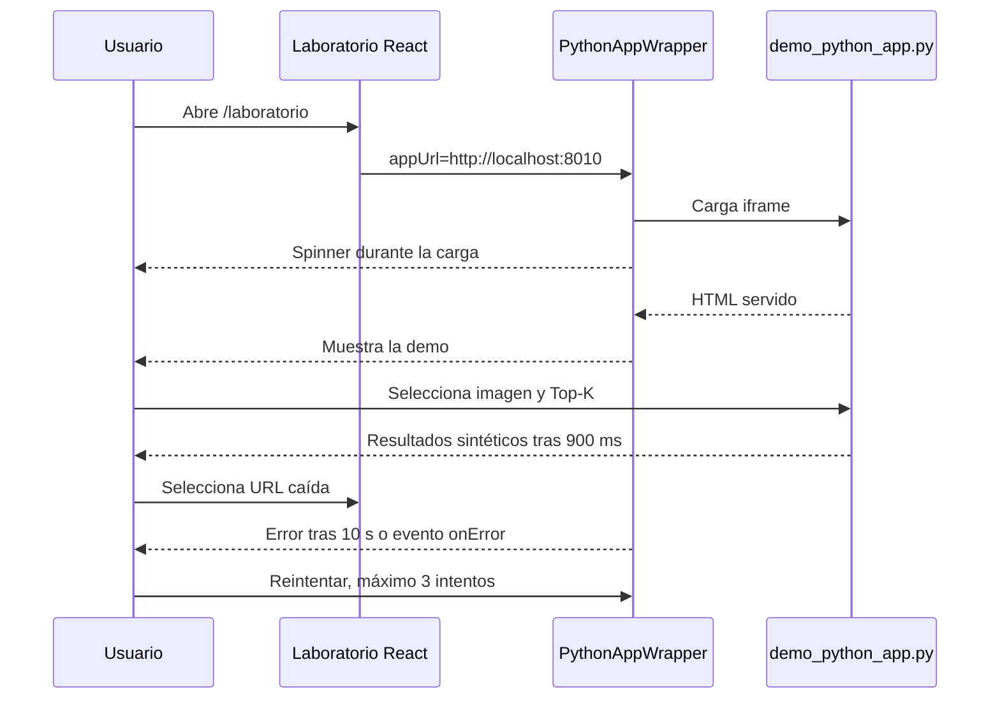

# Walkthrough: wrapper de aplicación Python en el Laboratorio

**Subfase:** 1.2, marco embebido para aplicaciones Python
**Desarrollador:** Emmanuel Davezac  
**Rama de trabajo:** `feature/fase1-wrapper`
**Estado:** implementación local pendiente de revisión y PR

## 1. Objetivo y motivación

El Laboratorio necesitaba un punto de integración visible para validar cómo una aplicación Python independiente podía convivir dentro de la interfaz React. El objetivo de esta subfase no era implementar todavía el gateway de inferencia real, sino probar el contrato de integración y sus estados principales:

- cargar una aplicación externa dentro de un marco responsive;
- informar visualmente mientras el contenido está cargando;
- detectar una URL caída aunque el navegador no dispare un error de `iframe`;
- permitir reintentos controlados;
- probar el caso correcto y el caso fallido desde la propia pantalla;
- disponer de una demo Python reproducible, sin depender de Supabase, FastAPI ni un modelo de IA.

La demo devuelve resultados sintéticos. Por tanto, una coincidencia mostrada en esta versión demuestra el flujo de interfaz, no la calidad de un modelo ni una consulta real a un índice vectorial.

## 2. Cumplimiento del flujo remoto

La [Skill de trabajo remoto](../../../.gemini/skills/gibd-remote-workflow/SKILL.md) define cuatro fases. Esta tarea se documenta con ese mismo orden:

### Fase 1: investigación y planificación

Antes de editar se revisaron la estructura de `frontend`, el enrutamiento existente, la página `Laboratorio`, el `package.json`, la guía [workflow_remote_collaboration.md](../../../workflow_remote_collaboration.md) y los artefactos de documentación disponibles. La hipótesis local fue: la forma menos invasiva de validar la integración es un componente aislado que reciba una URL por props y una demo HTTP independiente.

La comprobación que podía refutarla era compilar el frontend y ejecutar la demo por separado. Si el wrapper necesitaba dependencias adicionales o rompía el build, habría sido necesario cambiar la frontera de integración. No ocurrió: el build y la comprobación sintáctica Python pasaron.

No se encontró en esta copia un `implementation_plan.md` específico de esta subfase. Por eso este walkthrough conserva explícitamente el alcance, las decisiones y la verificación como registro retrospectivo. La ausencia del plan previo es una deuda documental, no una prueba de que la funcionalidad real del gateway exista.

### Fase 2: ejecución local

Se trabajó en `feature/fase1-wrapper`, sin modificar `main`. Se hicieron cambios pequeños y localizados: un componente nuevo, una demo nueva y una sección de integración en `Laboratorio`. La prueba se diseñó para ejecutarse con dos terminales: Vite para React y Python para la aplicación embebida.

### Fase 3: walkthrough y PR

Este documento registra los archivos, el funcionamiento, los comandos, los resultados, los errores encontrados, los límites y los pasos para el revisor. Antes de abrir el PR se debe adjuntar este walkthrough a la descripción y ejecutar de nuevo la validación desde una copia limpia de la rama.

### Fase 4: revisión asistida

Todavía no se ejecutó un review de un PR ni un despliegue de Preview en Vercel. El revisor debe comprobar compilación, estados del `iframe`, responsive, seguridad de URLs y que la rama `main` no reciba el cambio sin validación.

## 3. Inventario exacto de cambios

### [NEW] [frontend/src/components/PythonAppWrapper.tsx](../../../frontend/src/components/PythonAppWrapper.tsx)

Se creó un componente React reutilizable para encapsular una aplicación remota:

- `appUrl`: URL que se asigna al `src` del `iframe`.
- `title`: título accesible del `section` y del `iframe`.
- `aspectRatio`: relación configurable; por defecto es `16/9`.
- `onLoad`: callback opcional ejecutado cuando el `iframe` informa que cargó.

El estado se identifica con una clave formada por URL e intento. Al montar o cambiar esa clave, se inicia un timeout de 10 segundos. `onLoad` limpia el timeout y revela el `iframe` mediante opacidad. `onError` o el timeout muestran el error. La constante `MAX_ATTEMPTS = 3` limita los reintentos; después del tercero, el botón inicia otra ronda desde el intento 1.

La decisión de mantener el `iframe` montado mientras se muestra el overlay evita que la interfaz quede sin marco y permite que el navegador continúe resolviendo la URL. La propiedad `key` del uso en `Laboratorio` fuerza una navegación nueva cuando se alterna entre URL válida y caída. El `overflow-x-hidden` evita que contenido horizontal de la aplicación hija desborde la página anfitriona.

### [NEW] [backend/demo_python_app.py](../../../backend/demo_python_app.py)

Se creó un servidor estándar de Python basado en `http.server`, por lo que no requiere instalar paquetes:

- `ThreadingHTTPServer` permite atender nuevas conexiones sin quedar bloqueado por una conexión cancelada.
- `DemoHandler` sirve HTML para `/` y `/index.html`.
- `/health` responde JSON con estado `healthy` y nombre del servicio.
- Las demás rutas responden `404`.
- La aplicación escucha en `0.0.0.0:8010`, accesible desde el frontend mediante `http://localhost:8010`.
- La salida HTML contiene toda la demo y su JavaScript, evitando una segunda herramienta de build.

La UI Python permite elegir una imagen local, mostrar su vista previa, eliminarla con `X`, ajustar Top-K entre 1 y 10 y lanzar un procesamiento simulado de 900 ms. Los resultados se generan a partir de una lista fija de patentes y SVG `data:` creados en el navegador. Cada miniatura abre un modal ampliado; se puede cerrar con el botón, haciendo clic en el fondo o pulsando `Escape`.

### [MODIFY] [frontend/src/pages/Laboratorio.tsx](../../../frontend/src/pages/Laboratorio.tsx)

Se importó `PythonAppWrapper`, se añadió el estado `pythonTestUrl` con la URL válida como valor inicial y se agregó, después de las vistas multimodales existentes, una sección separada titulada “Aplicación Python embebida”.

La sección incluye dos controles de prueba:

- `URL válida` selecciona `http://localhost:8010`.
- `URL caída` selecciona `http://localhost:9999`, puerto usado como caso negativo suponiendo que no hay otro servicio allí.

El wrapper recibe el título `Motor de IA de Patentes` y registra en consola el evento de carga. La sección está separada por un borde superior para dejar claro que es una prueba de integración temporal y no reemplaza todavía el flujo principal del Laboratorio.

### [MODIFY] [frontend/public/favicon.svg](../../../frontend/public/favicon.svg)

El estado de Git muestra una modificación adicional de este SVG: 4 líneas añadidas y 1 eliminada. No forma parte de la lógica del wrapper ni de la demo Python y no se debe atribuir a la integración sin inspección visual del cambio. Debe incluirse en el PR como cambio independiente o retirarse antes del merge si fue accidental. Esta anotación evita ocultar un archivo modificado en la trazabilidad.

## 4. Funcionamiento completo



El wrapper no procesa la imagen, no transforma la respuesta y no conoce el protocolo interno de Python. Su responsabilidad termina en cargar y representar una URL. Esto permite sustituir la demo por el gateway real sin acoplar la página a una implementación concreta.

## 5. Cómo ejecutar y probar

Desde la raíz `c:\Users\Emma\Desktop\GIBD`, abrir dos terminales.

Terminal 1, servidor Python:

```powershell
python backend/demo_python_app.py
```

Debe aparecer `Demo Python GIBD disponible en http://localhost:8010`. Mantener esta terminal abierta. Sólo debe ejecutarse una instancia; si el puerto está ocupado, detener la instancia anterior antes de repetir.

Terminal 2, frontend:

```powershell
Push-Location frontend
npm run dev
Pop-Location
```

Abrir `http://127.0.0.1:5173/laboratorio` y desplazarse a “Aplicación Python embebida”.

### Caso exitoso

1. Dejar seleccionada `URL válida`.
2. Esperar el spinner y confirmar que aparece “Buscador visual de patentes”.
3. Seleccionar un JPG, PNG o WEBP; comprobar la vista previa.
4. Pulsar `X`, confirmar que la vista desaparece y seleccionar otra imagen.
5. Cambiar Top-K y pulsar `Analizar imagen`.
6. Confirmar el estado `Procesando...`, luego los resultados y el número seleccionado.
7. Pasar el cursor por una miniatura y confirmar la lupa.
8. Abrirla y cerrarla con `X`, fondo y `Escape`.

### Caso fallido y reintentos

1. Pulsar `URL caída`.
2. Esperar hasta 10 segundos; debe aparecer el mensaje de indisponibilidad.
3. Pulsar `Reintentar` y comprobar que el intento vuelve a cargar.
4. Repetir hasta observar el límite de tres intentos y el texto `Intentar de nuevo`.

La salud del proceso puede comprobarse sin el navegador:

```powershell
(Invoke-WebRequest -Uri "http://localhost:8010/health" -UseBasicParsing).Content
```

Resultado esperado:

```text
{"status": "healthy", "service": "GIBD similarity demo"}
```

## 6. Validaciones y resultados

Se ejecutaron estas comprobaciones:

```powershell
Push-Location frontend
npm run build
Pop-Location
```

Resultado: correcto. `tsc -b` y `vite build` finalizaron sin errores; Vite transformó 2205 módulos y generó `dist`. Vite emitió una advertencia no bloqueante sobre un chunk minificado mayor de 500 kB.

```powershell
Push-Location frontend
npx eslint src/components/PythonAppWrapper.tsx
Pop-Location
```

Resultado: correcto, sin salida ni errores.

```powershell
python -m py_compile backend/demo_python_app.py
```

Resultado: `py_compile: OK`.

También se intentó inicialmente `npm run build` y ESLint desde la raíz. El build falló con `Missing script: "build"` y ESLint intentó instalar un paquete porque el `package.json` relevante está dentro de `frontend`. Se corrigió el directorio, se repitieron las mismas pruebas y pasaron. Este error fue de procedimiento, no de implementación.

No se ejecutó una prueba E2E automatizada ni un Preview de Vercel en esta subfase. La validación interactiva descrita arriba debe quedar registrada con capturas o vídeo en el PR si el equipo los exige.

## 7. Cómo modificarlo

Para cambiar la URL real, modificar el valor inicial y los botones de `pythonTestUrl` en `Laboratorio.tsx`, o reemplazar los botones por una variable de entorno si la URL depende del entorno.

Para cambiar el tiempo de espera o el límite de reintentos, editar `LOAD_TIMEOUT_MS` y `MAX_ATTEMPTS` en `PythonAppWrapper.tsx`. Para agregar una prop nueva, actualizar la interfaz, el destructuring y este documento.

Para cambiar la forma del marco, ajustar `aspectRatio` al usar el componente, por ejemplo `aspectRatio="4/3"`. Para integrar el gateway real, conservar el wrapper y reemplazar sólo la URL; si el gateway exige autenticación, headers o `postMessage`, documentar y revisar esa decisión antes de implementarla.

Para extender la demo Python, modificar `HTML`, el método `do_GET` o crear endpoints adicionales. Si se agregan dependencias, actualizar `backend/requirements.txt` y documentar su instalación; la versión actual no necesita ninguna.

## 8. Límites, riesgos y pendientes

- La demo no invoca un modelo siamés ni un índice vectorial; sus resultados son fijos.
- El `iframe` no valida que la URL pertenezca a un origen permitido. Para producción debe definirse una allowlist y una política de seguridad acorde.
- El callback `onLoad` sólo escribe en consola desde `Laboratorio`; no existe todavía telemetría ni estado compartido.
- La URL `localhost` sólo funciona en el equipo que ejecuta Python. No es una URL de producción ni una URL válida para usuarios externos.
- El frontend ya tenía otras áreas no relacionadas con esta tarea; no se modificaron para evitar ampliar el alcance.
- Debe revisarse el cambio de `favicon.svg` antes del PR.
- Falta ejecutar la revisión asistida, crear el borrador de PR, abrir la Preview de Vercel y probarla antes de fusionar a `main`.

## 9. Checklist de aceptación y PR

- [x] Componente TypeScript reutilizable con props documentadas.
- [x] Carga, éxito, error, timeout y reintentos visibles.
- [x] Demo Python independiente y sin dependencias adicionales.
- [x] Endpoint `/health` disponible.
- [x] Caso de URL válida y URL caída accesibles desde Laboratorio.
- [x] Build del frontend validado.
- [x] ESLint del componente validado.
- [x] Sintaxis Python validada.
- [ ] Prueba manual completa con captura o evidencia del revisor.
- [ ] Auditoría de seguridad de la URL del iframe.
- [ ] Revisión de `favicon.svg`.
- [ ] Borrador de PR y enlace a este walkthrough.
- [ ] Preview de Vercel validada.
- [ ] Aprobación de otro desarrollador antes del merge a `main`.

### Borrador breve para el PR

**Motivo:** habilitar una integración local verificable entre el Laboratorio React y una aplicación Python independiente.

**Implementación:** se añadió `PythonAppWrapper`, se creó una demo HTTP Python con `/health` y se incorporó una sección temporal en `Laboratorio` con controles para probar URL disponible y caída.

**Pruebas del autor:** build Vite/TypeScript correcto, ESLint del wrapper correcto y `py_compile` correcto. Queda pendiente la revisión del PR, la Preview de Vercel y la validación del favicon modificado.

**Cómo revisar:** iniciar Python en el puerto 8010, iniciar Vite desde `frontend`, abrir `/laboratorio` y ejecutar los casos exitoso y fallido de este walkthrough.
