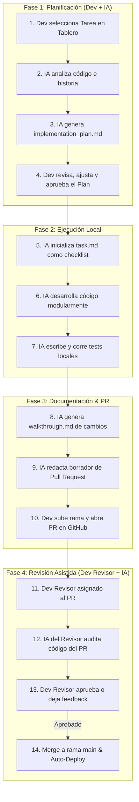

# Guía de Trabajo Remoto: 3 Devs + 3 Agentes de IA

Esta guía documenta el flujo de trabajo remoto del equipo de desarrollo del proyecto **GIBD WEB**. Define el proceso de colaboración, la metodología **GitHub Flow**, la integración de **Vercel** para despliegues automáticos a producción, y cómo incorporar **Skills** en agentes de Inteligencia Artificial (como Antigravity) para potenciar tu productividad.

---

## 1. El Flujo de Trabajo: Colaboración Humano + IA

Para trabajar de forma coordinada y segura, el equipo sigue una estructura de **4 fases**. En cada fase, el desarrollador humano lidera y toma las decisiones clave, mientras que su agente de IA asignado funciona como un copiloto de ingeniería, ejecutando código y documentando de forma precisa.

### Diagrama del Ciclo de Colaboración
A continuación se visualiza el ciclo de vida de una tarea desde que se asigna hasta que se completa:



---

## 2. GitHub Flow: Gestión del Código Paso a Paso

**GitHub Flow** es una metodología de trabajo ligera y basada en ramas que admite despliegues frecuentes y seguros.

### El ciclo de vida de una rama (Esquema Visual)

```
        Ramas de Características (Trabajo aislado con IAs)
         ┌────────────────────────────────────────────────────────┐
         │  feature/dashboard-filters                             │
         │  [Commit 1] ───> [Commit 2] ───> [Crear Pull Request]  │
─────────┴───────────────────────────────────────┬────────────────┴─────────► Rama 'main'
Rama 'main' (Siempre limpia y estable)           │  Aprobado & Fusionado (Merge)
                                                 ▼
                                           [AUTO-DEPLOY VERCEL]
                                           Lleva los cambios a
                                           Producción en vivo 🚀
```

### Los 5 pasos obligatorios de GitHub Flow:

1. **Crear una rama desde `main`:** 
   Antes de escribir código, asegurate de tener la última versión de `main` localmente y creá una rama con un nombre descriptivo:
   ```bash
   git checkout main
   git pull origin main
   git checkout -b feature/mi-nueva-funcionalidad
   ```
2. **Realizar commits locales descriptivos:**
   Hacé commits pequeños y bien explicados a medida que vos y tu IA avancen en el desarrollo.
3. **Abrir un Pull Request (PR):**
   Subí tu rama al repositorio remoto y abrí un PR para iniciar la discusión y revisión de los cambios. Tu IA redactará el borrador del PR.
4. **Revisión del código (Code Review):**
   El código es auditado por otro desarrollador (quien se apoyará en su respectiva IA). Si hay sugerencias, hacé los ajustes necesarios en la misma rama.
5. **Fusión (Merge):**
   Una vez aprobado el PR y habiendo superado los tests automáticos, se realiza el *Merge* hacia la rama `main`.

---

## 3. Despliegue Continuo con Vercel

> [!IMPORTANT]
> **La regla de oro de producción:** La rama `main` de este repositorio está conectada directamente con la plataforma de alojamiento **Vercel**. 

Esto significa que:
* **Cada vez que un PR se aprueba y se fusiona (Merge) a `main`, Vercel detecta el cambio automáticamente, compila la aplicación y despliega la nueva versión directamente a producción (a los usuarios reales).**
* Debido a esto, la rama `main` **nunca** debe tener código roto, experimental o sin probar. 
* Para pruebas previas, Vercel genera **URLs de Vista Previa (Preview Deployments)** de forma automática por cada Pull Request. De esta forma, el equipo puede testear la aplicación web en vivo antes de fusionarla a `main`.

---

## 4. ¿Cómo se instala la Skill local en tu Agente de IA?

Una **Skill (Habilidad)** es un conjunto de instrucciones técnicas (`SKILL.md`) que enseña a tu agente de IA copiloto las pautas, restricciones y metodologías del proyecto. 

Para instalar la Skill en el entorno de cualquier desarrollador del equipo, **no se requieren scripts ni configuraciones complejas**. Simplemente copia y pega el siguiente prompt en la interfaz de chat de tu agente de IA:

```text
Crea la carpeta local '.gemini/skills/gibd-remote-workflow/' en este repositorio y escribe en ella el archivo 'SKILL.md' con las directrices completas del manual de colaboración remota para el equipo GIBD: las fases obligatorias (planificación, ejecución local, walkthrough final) y la regla de protección de la rama main conectada con Vercel.
```

Al recibir esta instrucción, tu agente creará la carpeta local, escribirá las reglas técnicas y se auto-configurará de forma inmediata para seguir las pautas del equipo de forma estricta.

---

> [!TIP]
> **¡La Skill ya se encuentra instalada en este espacio de trabajo para ti!**
> La carpeta `.gemini/skills/gibd-remote-workflow/` ya ha sido creada y equipada con las pautas. Cualquier agente de IA que inicie sesión en este workspace acatará estas reglas automáticamente.

---

## 5. Glosario Técnico (Términos en palabras simples)

* **Rama (Branch):** Es como un "universo paralelo" o una copia independiente del código principal. Te permite trabajar en tus cambios sin afectar el trabajo de los demás hasta que estés listo.
* **Main (Rama Principal):** Es el tronco principal del código de tu aplicación. Es la versión oficial, estable y pública que ven los usuarios.
* **Commit:** Es una "foto" o un guardado de los cambios que realizaste en el código. Cada commit viene acompañado de un mensaje explicando qué cambiaste.
* **Pull Request (PR) / Solicitud de Extracción:** Es una propuesta para fusionar tus cambios (de tu rama) a la rama principal (`main`). Sirve para mostrarle a tu equipo qué hiciste, discutir el código y recibir aprobaciones.
* **Merge (Fusión):** El acto de unir los cambios de tu rama de trabajo con otra rama (habitualmente la rama `main`).
* **CI/CD (Integración Continuo / Despliegue Continuo):** Procesos automáticos que compilan, prueban y suben tu código a internet cada vez que hacés cambios, evitando que tengas que hacerlo manualmente.
* **Vercel:** Plataforma en la nube donde está alojada nuestra web. Automatiza los despliegues y nos da URLs en vivo para probar cada cambio.
* **Linter (Linterizador) / Formateador:** Herramienta automática que revisa que tu código no tenga errores de sintaxis y esté escrito con un formato ordenado y legible (como márgenes y espacios uniformes).
* **Regresión:** Un error o bug que aparece en una funcionalidad que antes andaba bien, generalmente provocado por introducir código nuevo en otra parte del sistema.
* **Skill (Habilidad):** Archivo de instrucciones (`SKILL.md`) que equipa a tu agente de IA con el contexto y las reglas técnicas específicas que debe seguir en un proyecto.
* **Sandbox (Entorno Seguro):** Un área segura y aislada en la máquina donde los agentes de IA ejecutan sus tareas sin peligro de dañar archivos del sistema operativo principal.
